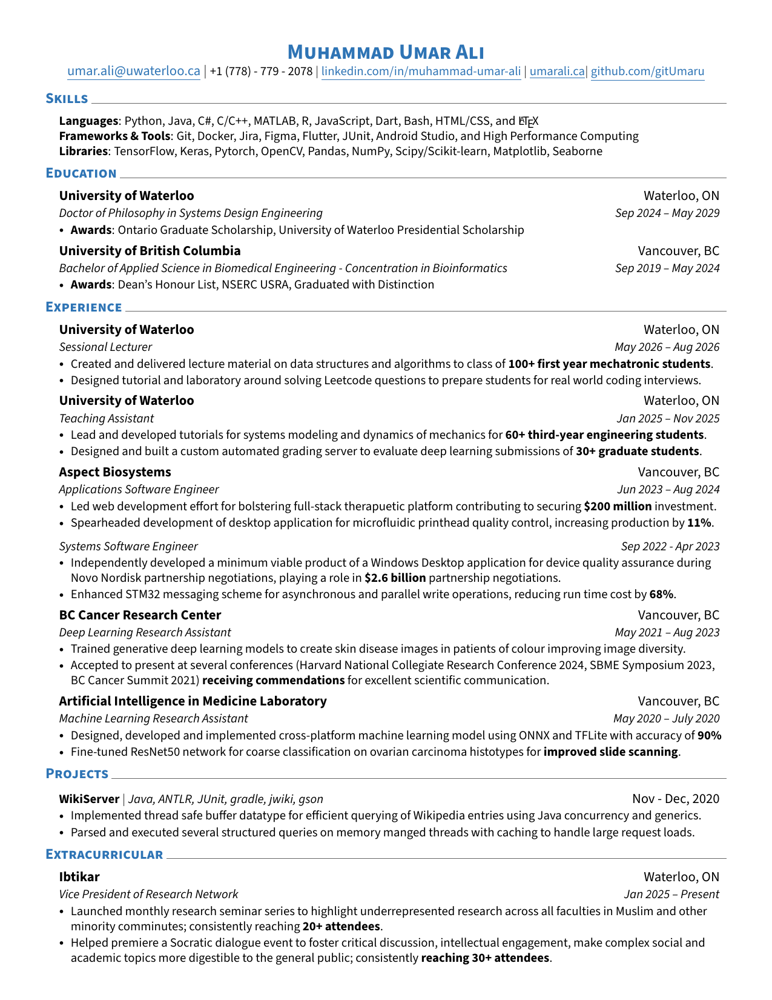

# Resume

A single-page LaTeX resume built from modular section files. The main document
(`resume.tex`) sets up formatting and fonts, then pulls in each section from the
`src/` directory so content can be edited independently of layout. The compiled
output is committed as `resume.pdf`.

Based on the [sb2nov/resume](https://github.com/sb2nov/resume) template. Licensed
under MIT.

## Preview



## Repository layout

| Path | Role |
| --- | --- |
| `resume.tex` | Main entry point. Sets the document class, packages, margins, section styling, and font choice. Controls which sections are included. |
| `custom-commands.tex` | Defines the resume-specific macros (`\resumeSubheading`, `\resumeItem`, `\resumeProjectHeading`, etc.) and the accent color used for section titles and links. |
| `src/` | One `.tex` file per resume section, each pulled into `resume.tex` via `\input`. |
| `resume.pdf` | The compiled resume. |
| `archive/` | Standalone earlier/alternate versions of the resume (`main.tex`, `anon.tex`, `bioinf.tex`, `verbose.tex`). Kept for reference; not part of the current build. |

### Section files in `src/`

Each file begins with a `\section{...}` and contains only that section's content:

- `heading.tex`: name and contact links (email, phone, LinkedIn, personal site, GitHub)
- `skills.tex`: languages, frameworks/tools, and libraries
- `education.tex`: degrees and awards
- `experience.tex`: work history
- `projects.tex`: project entries
- `extracurricular.tex`: extracurricular roles
- `publications.tex`: publications and conferences
- `volunteer.tex`: volunteer roles
- `certificates.tex`: certifications
- `awards.tex`: awards

## Requirements

You need a LaTeX distribution that provides `pdflatex` and the packages used in
`resume.tex`, for example:

- [TeX Live](https://www.tug.org/texlive/) (cross-platform)
- [MiKTeX](https://miktex.org/) (Windows)
- [MacTeX](https://www.tug.org/mactex/) (macOS)

The document loads these packages (all standard in a full TeX distribution):
`latexsym`, `fullpage`, `titlesec`, `marvosym`, `color`, `verbatim`, `enumitem`,
`hyperref`, `fancyhdr`, `babel`, `tabularx`, `multicol`, and the
`sourcesanspro` font package. It also runs `\input{glyphtounicode}` so text in
the PDF stays copy/paste-friendly.

If you use a minimal TeX install, make sure `sourcesanspro` and the packages
above are installed.

## Building

`resume.tex` is the file to compile. Run `pdflatex` from the repository root so
the relative `\input{src/...}` paths resolve:

```bash
pdflatex resume.tex
```

This produces `resume.pdf` in the repository root, alongside the usual auxiliary
files (`.aux`, `.log`, `.out`).

You can also open `resume.tex` in an editor with LaTeX support (VS Code +
LaTeX Workshop, TeXstudio, Overleaf, etc.) and build from there.

## Customizing content

Edit the file for the section you want to change under `src/`. For example,
update work history in `src/experience.tex` or contact details in
`src/heading.tex`. Because each section is a separate file, you can rewrite one
area without touching the layout or other sections.

Entries are written with the macros defined in `custom-commands.tex`:

- `\resumeSubheading{Title}{Location}{Role}{Dates}`: a bold heading row with a
  right-aligned location and an italic role/date row (used in education,
  experience, extracurricular).
- `\resumeSubSubheading{Role}{Dates}`: a secondary role line under an existing
  subheading (e.g. a second title at the same employer).
- `\resumeProjectHeading{Title | tech}{Dates}`: a project entry heading.
- `\resumeItem{...}`: a single bullet point.
- Wrap bullet lists in `\resumeItemListStart` ... `\resumeItemListEnd`, and wrap
  a group of subheadings in `\resumeSubHeadingListStart` ...
  `\resumeSubHeadingListEnd`.

## Showing or hiding sections

Which sections appear in the resume is controlled in `resume.tex` by the list of
`\input{src/...}` lines. Comment out a line to drop a section, or uncomment one
to add it back. In the current document, `heading`, `skills`, `education`,
`experience`, `projects`, and `extracurricular` are active, while
`publications`, `volunteer`, `certificates`, and `awards` are commented out:

```latex
\input{src/extracurricular}

% \input{src/publications}
% \input{src/volunteer.tex}
% \input{src/certificates.tex}
% \input{src/awards.tex}
```

Reorder sections by moving these lines.

## Changing fonts

Fonts are selected near the top of `resume.tex` in the `FONT OPTIONS` block. One
option is active and the rest are commented out. The current font is Source Sans
Pro:

```latex
\usepackage[default]{sourcesanspro}
```

To switch fonts, comment out the active line and uncomment one of the provided
alternatives (sans-serif: `FiraSans`, `roboto`, `noto-sans`; serif:
`CormorantGaramond`, `charter`). Make sure the corresponding font package is
installed in your TeX distribution.

## Adjusting formatting

- **Accent color**: `custom-commands.tex` defines `\definecolor{primay}{RGB}{46, 116, 181}`,
  used by `\bbold` and `\bunderline` for section titles and links. Change the RGB
  values to recolor these elements.
- **Margins and spacing**: `resume.tex` sets margins via `\addtolength{...}` and
  section styling via `\titleformat{\section}{...}`. Adjust these to change the
  overall density and section heading appearance.

## Generating the final PDF

Compile `resume.tex` with `pdflatex` as shown above. The resulting `resume.pdf`
in the repository root is the final, shareable document.

## Updating the preview

The image in the [preview](#preview) section is `docs/resume-preview.png`, a PNG
rendered from `resume.pdf`. It does not update automatically, so regenerate it
whenever the resume content or layout changes.

1. Rebuild the PDF so `resume.pdf` reflects your edits:

   ```bash
   pdflatex resume.tex
   ```

2. Render `resume.pdf` to `docs/resume-preview.png` with `pdftoppm` (part of
   Poppler; bundled with most TeX distributions):

   ```bash
   pdftoppm -png -r 150 -singlefile resume.pdf docs/resume-preview
   ```

   The `-r 150` flag sets the resolution (raise it for a sharper image), and
   `-singlefile` keeps the output name exactly `docs/resume-preview.png`.

If the resume grows beyond one page, drop `-singlefile`. `pdftoppm` then writes
one image per page (`docs/resume-preview-1.png`, `docs/resume-preview-2.png`,
...); update the `![...]` reference in the Preview section to match.

## (Optional) Using this resume with AI agents

This repository is the single source of truth for all resume content. When an
AI agent tailors the resume to a specific job description, it should **only
comment or uncomment existing content**; never rewrite, add, or delete the
underlying text.

Rules for agents:

- **Toggle, don't author.** Enable or disable existing bullets, sections,
  skills, or entries by commenting (`%`) or uncommenting the relevant lines.
- **Preserve wording and structure.** Keep the original phrasing, macros, and
  ordering intact.
- **No invented content.** Do not fabricate qualifications, experience,
  accomplishments, skills, or dates that are not already in the repository.
- **Source of truth stays put.** All content lives in `resume.tex` and the
  `src/` files; tailoring only changes what is shown, not what exists.

The goal is a job-specific version assembled entirely from content already in
the repository.

Example: given a job description that emphasizes teaching over deep learning, an
agent might keep a relevant experience bullet in `src/experience.tex` active and
comment out a less relevant one; leaving both lines' text unchanged:

```latex
\resumeItem{Lead and developed tutorials for systems modeling and dynamics of mechanics for \textbf{60+ third-year engineering students}.}
% \resumeItem{Designed and built a custom automated grading server to evaluate deep learning submissions of \textbf{30+ graduate students}.}
```

After toggling, rebuild with `pdflatex resume.tex` to produce the tailored PDF.
